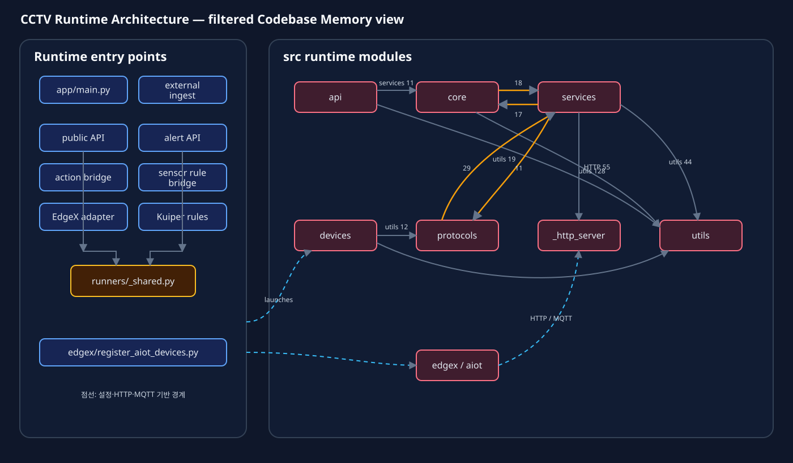
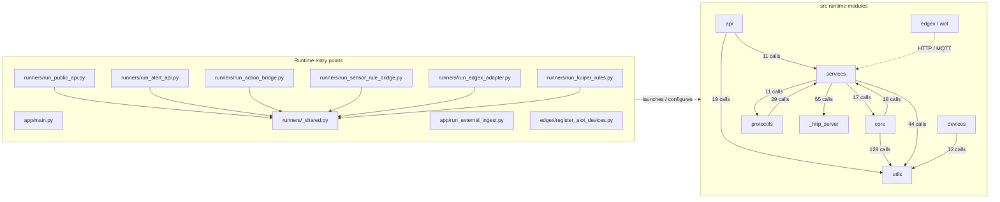

# CCTV Runtime Architecture Graph

이 문서는 Codebase Memory의 전체 그래프에서 문서, 테스트, 학습 코드와
Python built-in 노드를 제외하고 운영 코드의 연결만 요약한 뷰다.

[SVG로 크게 보기](./CODEBASE_MEMORY_RUNTIME_GRAPH.svg)



## Filter

- 포함 경로: `src/`, `app/`, `runners/`, `edgex/`
- 포함 노드: Function, Method, Class, Route, 실행 진입점
- 포함 관계: CALLS, IMPORTS, HTTP_CALLS, ASYNC_CALLS, HANDLES
- 제외 경로: `tests/`, `scripts/`, `data/`, `.worktrees/`
- 제외 대상: Variable, Section, Python built-in 및 외부 라이브러리

## Runtime overview



## Reading notes

- 실선과 호출 수는 Codebase Memory의 `src` 경계 분석에서 확인된 CALLS 관계다.
- 점선은 실행 또는 설정 경계를 나타낸다. 환경변수, Docker Compose, MQTT topic,
  HTTP URL처럼 정적 함수 호출만으로 완전히 해석되지 않는 연결이다.
- `core`와 `services`, `services`와 `protocols`는 패키지 수준에서 양방향
  의존으로 집계된다. 현재 함수 재귀나 실행을 막는 순환 import는 확인되지 않았다.
- `utils`는 여러 모듈에서 사용되는 공통 의존성이다.
- 전체 그래프의 붉은 외곽 클러스터 대부분은 파일 내부 정의, 변수, 테스트,
  문서 Section 노드이므로 런타임 아키텍처 판단에서는 제외한다.

## Bidirectional dependency review

### `core` and `services`

- `core/_event_context.py`가 `services/appearance_conditions.py`를 사용한다.
- `core/ai/_appearance_pipeline.py`는 로그가 필요할 때
  `services/appearance_log.py`를 지연 import한다.
- `services/sensor_bridge.py`와 `services/sensor_rule_bridge.py`가
  `core/sensor_detection.py`를 사용한다.
- API 서비스가 참조하는 일부 `core` 타입은 `TYPE_CHECKING` 블록 안에 있어
  런타임 import가 아니다.

### `services` and `protocols`

- `services/action_bridge.py`, `external_ingest.py`, `sensor_bridge.py`가
  HTTP, REST, MQTT 구현을 `protocols`에서 사용한다.
- `protocols/rest.py`는 액션 인터페이스와 metrics registry를 `services`에서
  사용한다.
- 현재 가장 긴 패키지 왕복 경로는
  `services/action_bridge.py → protocols/rest.py → services/_action_bridge_support.py`
  이다. 같은 모듈로 되돌아가는 직접 순환은 아니다.

### Validation

아래 관련 테스트를 실행해 import, 초기화 및 주요 호출 경로를 확인했다.

```text
tests/test_action_bridge.py
tests/test_integration_action_pipeline.py
tests/test_appearance_pipeline.py
tests/test_sensor_bridge.py
tests/test_sensor_detection.py
```

결과: `119 passed`

## Current graph scope

| Path | Nodes | Edges | Role |
|---|---:|---:|---|
| `src/` | 2,428 | 8,685 | 핵심 런타임 |
| `runners/` | 88 | 233 | 서비스 실행 진입점 |
| `app/` | 12 | 18 | 애플리케이션 진입점 |
| `edgex/` | 79 | 99 | EdgeX 등록 및 설정 |
